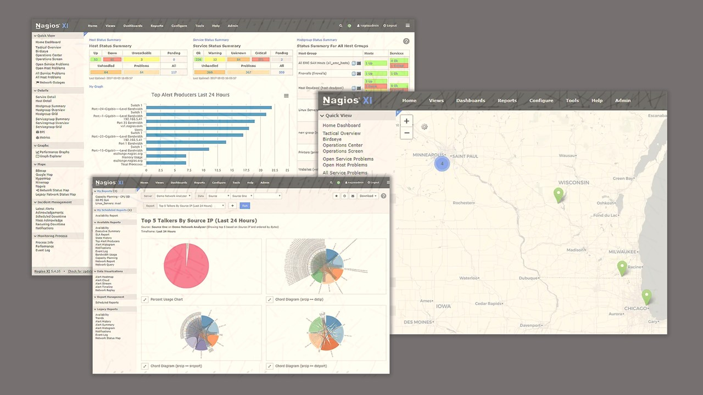

Udemy Course >> Nagios for DevOps and IT Network System Administrators

Nagios Product a Hands-on Course on How to Use Nagios - Cloud and On-premises Environments - Network System Monitoring

**********

Tips/Tricks/Notes/Commands URL Link: 
https://github.com/nimaxnimax/Udemy_Nagios

Instructor & Courses >> 
https://www.udemy.com/user/adrian-fischer-infotech/

**********

Nagios

- **Nagios XI**: Nagios XI is the enterprise-grade version of Nagios, offering advanced features and capabilities for comprehensive IT infrastructure monitoring.

- **Centralized Monitoring**: Provides a centralized platform for monitoring servers, network devices, applications, and services from a single interface.

- **Real-time Monitoring**: Offers real-time monitoring of system performance metrics, including CPU usage, memory usage, disk space, and network bandwidth.

- **Customizable Dashboards**: Allows users to create customizable dashboards with graphs, charts, and status overviews to visualize monitoring data.

- **Alerting and Notifications**: Supports customizable alerting and notification mechanisms to alert administrators of critical issues via email, SMS, or other methods.

- **Scalability**: Designed to scale from small to large-scale environments, supporting thousands of devices and services.

- **Automation**: Enables automation of monitoring tasks and remediation actions through plugins, event handlers, and configuration wizards.

- **Reporting**: Provides advanced reporting capabilities with built-in and customizable reports to analyze historical performance data and trends.

- **Integration**: Integrates with other IT management tools, such as ticketing systems, configuration management platforms, and cloud services.

- **Security**: Offers security features including role-based access control (RBAC), LDAP/Active Directory integration, and encryption protocols to protect monitoring data.

- **Support and Community**: Backed by professional support options and an active user community for assistance, troubleshooting, and knowledge sharing.

- **Web-based Interface**: Features an intuitive web-based interface for easy navigation and management of monitoring configurations and settings.

**********

Advantages

- Comprehensive monitoring solution for IT infrastructure.
- Real-time visibility into system performance and health.
- Customizable alerts and notifications for prompt issue resolution.
- Scalable architecture capable of handling large-scale environments.
- Automation of monitoring tasks and remediation actions.
- Advanced reporting and visualization capabilities.
- Integration with other IT management tools and services.
- Enhanced security features to protect monitoring data.
- Professional support options and active user community for assistance.
- Intuitive web-based interface for easy management and configuration.

**********

Disadvantages

While Nagios XI offers many advantages, it also comes with some potential disadvantages:

- **Complex Setup**: Setting up Nagios XI may require a steep learning curve, especially for users new to monitoring tools or without a strong background in IT infrastructure management.

- **Resource Intensive**: Running Nagios XI may require significant system resources, particularly in large-scale deployments, which could impact performance if not properly configured.

- **Cost**: Nagios XI is not free like its open-source counterpart Nagios Core. The enterprise-grade features of Nagios XI come with licensing costs, which may not be feasible for some organizations, especially smaller ones with limited budgets.

- **Maintenance Overhead**: Nagios XI requires ongoing maintenance and updates to ensure optimal performance and security, which may require dedicated resources and time from IT staff.

- **Limited Community Support**: While Nagios has a strong user community, the enterprise-specific features of Nagios XI may not receive as much community support or have as many third-party plugins available compared to Nagios Core.

- **Steep Learning Curve for Advanced Features**: While basic monitoring tasks are relatively straightforward, mastering advanced features and customization options in Nagios XI may require additional training and expertise.

- **Vendor Lock-in**: Opting for Nagios XI means relying on a specific vendor for support and updates, potentially leading to vendor lock-in and limited flexibility in switching to alternative monitoring solutions.

- **GUI Limitations**: While the web-based interface of Nagios XI is user-friendly, it may have limitations in terms of customization and flexibility compared to text-based configurations available in Nagios Core.

While Nagios XI offers robust monitoring capabilities, organizations should carefully consider these potential disadvantages before implementing it as their monitoring solution.

**********

Port Numbers

For Nagios monitoring, several port numbers are essential for its operation and communication. Here are the important port numbers associated with Nagios:

1. **Nagios Web Interface**:
   - Port 80: Default port for accessing the Nagios Core web interface.
   - Port 443: Default port for accessing the Nagios Core web interface securely (if SSL/TLS is enabled).

2. **NRPE (Nagios Remote Plugin Executor)**:
   - Port 5666: Default port used by NRPE for communication between Nagios server and monitored hosts. This port is utilized for executing monitoring plugins and retrieving results.

3. **NSCA (Nagios Service Check Acceptor)**:
   - Port 5667: Default port used by NSCA for communication between Nagios server and passive check service clients. This port is utilized for sending check results from external systems to Nagios.

4. **SNMP (Simple Network Management Protocol)**:
   - Port 161: Default port for SNMP queries (SNMP GET) used by Nagios for monitoring network devices and services.
   - Port 162: Default port for SNMP traps (SNMP notifications) received by Nagios from monitored devices.

5. **Nagios Core Command Pipe**:
   - The command pipe is used for external commands to control Nagios Core, such as scheduling downtime, acknowledging alerts, etc. Its path is typically defined in the Nagios configuration files (e.g., `/var/nagios/rw/nagios.cmd`).

These ports are crucial for Nagios to perform monitoring tasks, receive check results, and interact with various components of the monitoring infrastructure. Understanding and properly configuring these port settings are essential for setting up Nagios effectively within an IT environment.

**********

Installation Options

Installation of Nagios can indeed be accomplished through various means, including on-premises, cloud-based, or virtualized environments such as VMware. Here are installation options for each scenario:

1. **On-Premises Installation**:
   - **Manual Installation**: Download the Nagios Core source code from the official website and follow the installation instructions provided in the documentation. This involves configuring and compiling Nagios from source on your on-premises server infrastructure.
   - **Pre-built Packages**: Install Nagios using pre-built packages available for your specific Linux distribution. Use your distribution's package manager (e.g., apt, yum) to install Nagios Core and its dependencies.

2. **Cloud-based Installation**:
   - **Deploy from Marketplace**: Many cloud service providers offer Nagios instances pre-configured and ready to deploy through their respective marketplaces. You can choose a Nagios instance from the marketplace, configure it according to your needs, and deploy it directly onto your cloud infrastructure.
   - **Manually Provisioned Instances**: Create virtual machines (VMs) on your cloud provider of choice (e.g., AWS, Azure, Google Cloud) and install Nagios on these instances manually. This involves setting up a Linux server instance, installing Nagios Core, and configuring it for monitoring.

3. **VMware Installation**:
   - **Virtual Appliance**: VMware offers virtual appliances pre-configured with Nagios, which can be downloaded and deployed within your VMware environment. These virtual appliances typically come with Nagios Core and other necessary components pre-installed and ready to use.
   - **Manual Installation on VMs**: Create virtual machines within your VMware environment and install Nagios manually on these VMs. You can choose to install Nagios from source or use pre-built packages, similar to on-premises installations.

When deciding on the installation method, consider factors such as ease of deployment, scalability, maintenance overhead, and compatibility with your existing infrastructure. Each option offers its own advantages and may be more suitable depending on your organization's specific requirements and preferences.

**********

Requirements

The minimum requirements for installing Nagios can vary depending on factors such as the size of the environment being monitored, the number of hosts and services, and the level of monitoring intensity. However, here are general minimum requirements for running Nagios Core:

1. **Hardware Requirements**:
   - CPU: 1 GHz or higher (multi-core recommended for larger installations)
   - RAM: 512 MB minimum (1 GB or more recommended)
   - Disk Space: 1 GB minimum for Nagios Core installation (additional space required for log files, performance data, etc.)

2. **Operating System**:
   - Nagios Core is typically installed on Linux distributions such as CentOS, Debian, Ubuntu, or RHEL. It can also be installed on other Unix-like systems.

3. **Software Dependencies**:
   - Apache Web Server: Required for the Nagios Core web interface.
   - PHP: Required for dynamic content generation in the web interface.
   - Perl: Required for executing Nagios plugins.
   - Additional libraries and dependencies may be needed depending on the plugins and features you plan to use.

4. **Network Connectivity**:
   - Access to the network for monitoring hosts and services.
   - Ports for communication with monitored devices (e.g., SNMP, NRPE, NSCA) should be accessible.

5. **Permissions**:
   - The user account installing Nagios should have sufficient permissions to install software, create directories, and modify configuration files.

It's important to note that these are basic minimum requirements, and actual resource needs may vary based on factors such as the size and complexity of your monitoring setup, the number of checks being performed, and the frequency of monitoring. Additionally, for larger installations or environments with high availability requirements, you may need to allocate more resources and implement distributed monitoring setups for scalability and redundancy.

**********

Download Nagios XI

URL: https://www.nagios.com/products/nagios-xi/downloads/?submit=success

**********

Download Options 1

Open Virtualization Format 64-bit .ova >> This is the quickest way to start using Nagios XI. Works with: VMware, VirtualBox, and anything that can use OVF. View Installation Guide.

URL: https://go2.nagios.com/get-xi/ova

URL: https://assets.nagios.com/downloads/nagiosfusion/docs/Installing-Nagios-Fusion-with-VMware-Workstation-Player.pdf

**********

Download Options 2

Hyper-V 64-bit .vhd >> This download works within Hyper-V.

URL: https://go2.nagios.com/get-xi/vpc

URL: https://assets.nagios.com/downloads/nagiosxi/docs/Installing-Nagios-XI-with-Hyper-V.pdf

**********

Download Options 3

Workstation Pro/Player 64-bit .ova >> This is the quickest way to start using Nagios XI.
Works with: VMware Workstation Pro/Player, VirtualBox, and anything that can use OVF.

URL: https://go2.nagios.com/get-xi/ova

URL: https://assets.nagios.com/downloads/nagiosxi/docs/Installing-Nagios-XI-with-VMware-VM-Workstation-Player.pdf

**********

Download Options 4

ESXi and vSphere 64-bit .ova >> Deploy as a VM on VMware ESXi host. Works with: VMware VSphere 5/6.

URL: https://go2.nagios.com/get-xi/ova

URL: https://assets.nagios.com/downloads/nagiosxi/docs/Installing-Nagios-XI-with-VMware-ESX-vSphere.pdf

**********

Download Options 5

Azure/AWS/GCP/DigitalOcean/Linode

Manual 64-bit .tar.gz >> This download is to manually install Nagios XI on CentOS, RedHat Enterprise, Oracle, Debian, or Ubuntu LTS.

URL: https://go2.nagios.com/get-xi/source

URL: https://assets.nagios.com/downloads/nagiosxi/docs/Installing-Nagios-XI-Manually-on-Linux.pdf

```bash
curl https://assets.nagios.com/downloads/nagiosxi/install.sh | sh
```

**********

